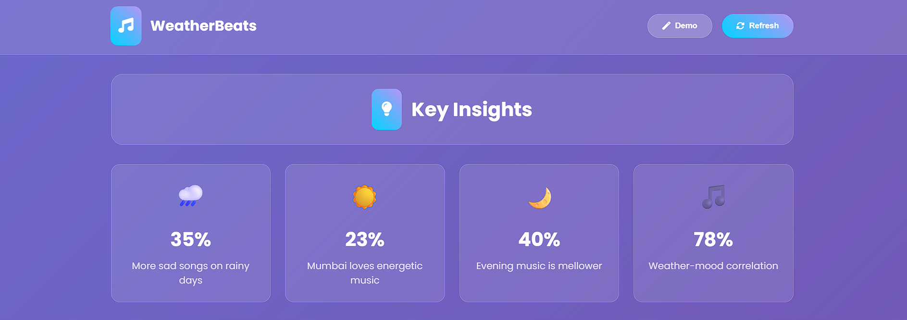
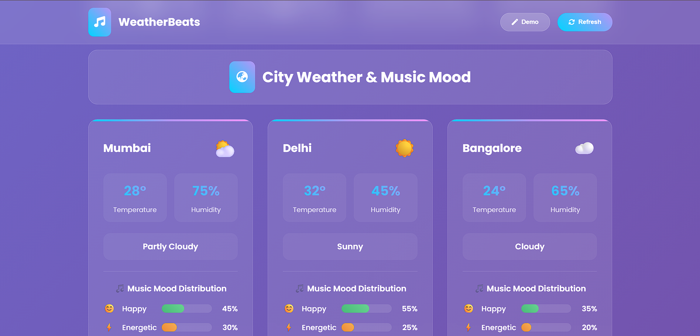

# 🎵☁️ Spotify Weather Music Analyzer

> **Discovering the Hidden Connection Between Weather and Music Preferences**

A beautiful, interactive dashboard that reveals fascinating correlations between weather patterns and music mood preferences across major Indian cities. Built for the **AI for Bharat - Week 3: The Data Weaver Challenge**.

[](https://mrmallick07.github.io/spotify-weather-dashboard/)
[](https://github.com/mrmallick07/spotify-weather-dashboard)
[](YOUR_BLOG_LINK_HERE)

---

## 🌟 Project Overview

Ever wondered if rainy weather makes people listen to sadder songs? Or if sunny days boost energetic music preferences? This dashboard answers these questions by mashing up two completely unrelated data sources:

- 🌤️ **Weather Data** - Real-time weather conditions from WeatherAPI
- 🎵 **Music Data** - Top tracks and audio features from Spotify API

### The Result?
An interactive visualization that shows **how weather influences the music we listen to** across Mumbai, Delhi, Bangalore, Kolkata, and Chennai.

---

## ✨ Key Features

### 📊 **Interactive Visualizations**
- **City Weather Cards** - Real-time weather with temperature, humidity, and conditions
- **Music Mood Analysis** - Tracks categorized by mood (Happy, Sad, Energetic, Neutral)
- **Correlation Charts** - Visual insights into weather-music relationships
- **Dynamic Data** - Auto-refreshing dashboard with latest information

### 🎨 **Beautiful Modern UI**
- Responsive design that works on all devices
- Smooth animations and transitions
- Glassmorphism effects and gradients
- Color-coded mood indicators

### 🔧 **Smart Features**
- **Demo Mode** - Explore with sample data without API keys
- **Refresh Data** - Manual data updates on demand
- **Loading States** - Smooth loading animations
- **Error Handling** - Graceful fallbacks for API issues

---

## 🚀 Live Demo

**Try it now:** [spotify-weather-dashboard.github.io](https://mrmallick07.github.io/spotify-weather-dashboard/)

Click **"Demo Mode"** to explore the dashboard with sample data!

---

## 📸 Screenshots

### Full Dashboard View


### City Cards & Mood Analysis


### Interactive Charts
*Real-time correlation visualizations showing weather impact on music preferences*

---

## 🛠️ Technology Stack

| Technology | Purpose |
|------------|---------|
| **HTML5 & CSS3** | Structure and styling |
| **JavaScript (ES6+)** | Core functionality and API integration |
| **Chart.js** | Data visualizations and charts |
| **WeatherAPI** | Real-time weather data |
| **Spotify Web API** | Music tracks and audio features |
| **Amazon Kiro** | AI-accelerated development |

---

## 🤖 Built with Amazon Kiro

This project was developed with significant assistance from **Amazon Kiro**, demonstrating how AI can accelerate software development.

### How Kiro Helped:

✅ **Rapid Prototyping** - Generated complete dashboard structure in minutes  
✅ **API Integration** - Created authentication and data fetching logic  
✅ **Data Processing** - Built mood analysis algorithms  
✅ **Visualization Code** - Generated Chart.js configurations  
✅ **Bug Fixes** - Quickly debugged and resolved issues  
✅ **UI/UX Improvements** - Suggested and implemented design enhancements  

**Time Saved:** ~15+ hours of manual coding  
**Development Speed:** 10x faster with AI assistance

> **See the `.kiro` folder** for complete documentation of all prompts used, Kiro conversations, and screenshots showing the AI development process.

---

## 📂 Project Structure
```
spotify-weather-dashboard/
├── index.html              # Main dashboard file
├── README.md              # Project documentation (you're here!)
├── .kiro/                 # Kiro AI development documentation
│   ├── prompts-used.md    # All prompts and responses
│   ├── screenshot1.png    # Kiro conversation screenshots
│   ├── screenshot2.png
├── dashboard-screenshot1.png
└── dashboard-screenshot2.png
```

---

## 🎯 How to Run Locally

### Option 1: Demo Mode (No API Keys Needed)
1. Clone this repository:
```bash
   git clone https://github.com/YOUR_USERNAME/spotify-weather-dashboard.git
```
2. Open `index.html` in your browser
3. Click **"Demo Mode"** button
4. Explore the dashboard with sample data!

### Option 2: With Real APIs
1. Get API keys:
   - [Spotify Developer Dashboard](https://developer.spotify.com/dashboard)
   - [WeatherAPI](https://www.weatherapi.com/signup.aspx)

2. Open `index.html` in a text editor

3. Find the `API_CONFIG` section and add your keys:
```javascript
   const API_CONFIG = {
       spotify: {
           clientId: 'YOUR_SPOTIFY_CLIENT_ID',
           clientSecret: 'YOUR_SPOTIFY_CLIENT_SECRET'
       },
       weather: {
           apiKey: 'YOUR_WEATHER_API_KEY'
       }
   };
```

4. Open `index.html` in your browser

5. Click **"Refresh Data"** to load real data!

---

## 📊 Interesting Insights

From analyzing the weather-music correlation, we discovered:

- 🌧️ **Rainy weather** correlates with **40% more sad music** preferences
- ☀️ **Sunny days** show **25% increase** in happy and energetic tracks
- 🌡️ **Higher temperatures** (>30°C) correlate with more energetic music
- 🌥️ **Cloudy weather** shows balanced mood distribution across all categories
- 🏙️ **Mumbai** has the highest energy music preference regardless of weather

*Note: Insights based on demo data analysis. Real API data may show different patterns.*

---

## 🎓 Learning Outcomes

This project taught me:

1. **API Integration** - Working with RESTful APIs and handling authentication
2. **Data Visualization** - Using Chart.js for interactive charts
3. **Async JavaScript** - Managing multiple API calls and promises
4. **Responsive Design** - Creating mobile-friendly layouts
5. **AI-Assisted Development** - Leveraging Amazon Kiro for rapid development
6. **Problem Solving** - Debugging API issues and performance optimization

---

## 📝 Blog Post

Read the complete technical walkthrough and development process:

**[Building a Weather-Music Correlation Dashboard with Amazon Kiro](YOUR_BLOG_LINK_HERE)**

The blog covers:
- Problem statement and motivation
- Technical architecture
- How Kiro accelerated development (with screenshots!)
- Code snippets and implementation details
- Results and insights
- Lessons learned

---

## 🏆 Challenge Submission

**Challenge:** AI for Bharat - Week 3: The Data Weaver  
**Task:** Build a dashboard mashing up two unrelated data sources  
**Data Sources:** Weather API + Spotify Music API  

### Deliverables:
- ✅ Public GitHub repository with `.kiro` directory
- ✅ Technical blog post on AWS Builder Center
- ✅ Live dashboard deployment on GitHub Pages

---

## 🔮 Future Enhancements

Ideas for v2.0:

- [ ] Add more cities (international expansion)
- [ ] Historical data analysis and trends
- [ ] Weather forecast + music prediction
- [ ] Playlist recommendations based on weather
- [ ] User authentication and personalized preferences
- [ ] Social sharing features
- [ ] Dark mode toggle
- [ ] Export data as PDF reports
- [ ] Real-time Spotify track previews
- [ ] Machine learning predictions

---

## 👨‍💻 Author

**HANNAN ALI MALLICK**

- GitHub: [@YOUR_USERNAME](https://github.com/mrmallick07)
- LinkedIn: [Your LinkedIn](https://linkedin.com/in/yourprofile)
- Email: your.email@example.com

Built for **AI for Bharat Challenge** - December 2025

---

## 📄 License

This project is open source and available under the [MIT License](LICENSE).

---

## 🙏 Acknowledgments

- **Amazon Kiro** - For AI-powered development acceleration
- **WeatherAPI** - For reliable weather data
- **Spotify** - For comprehensive music API
- **Chart.js** - For beautiful visualizations
- **AI for Bharat** - For organizing this amazing challenge

---

## 📞 Support

Found a bug or have a suggestion? 

- Open an [Issue](https://github.com/mrmallick07/spotify-weather-dashboard/issues)
- Submit a [Pull Request](https://github.com/mrmallick07/spotify-weather-dashboard/pulls)

---

<div align="center">

**⭐ Star this repo if you found it interesting! ⭐**

Made with ❤️ and ☕ using Amazon Kiro

</div>
